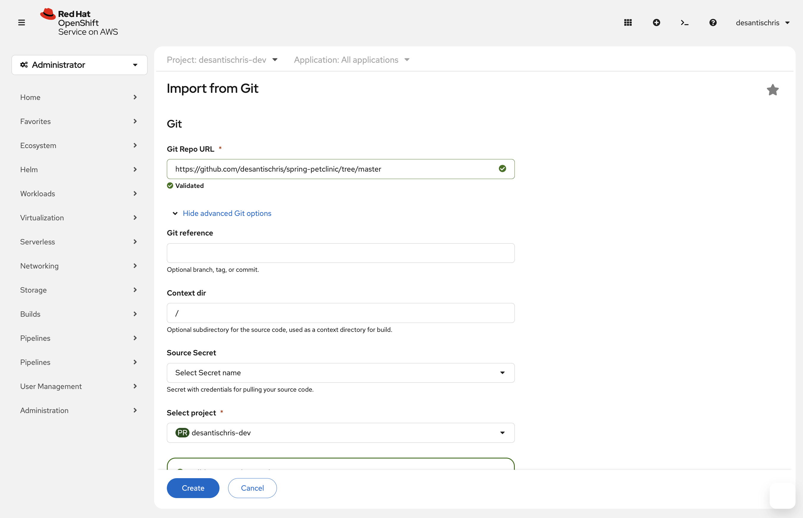
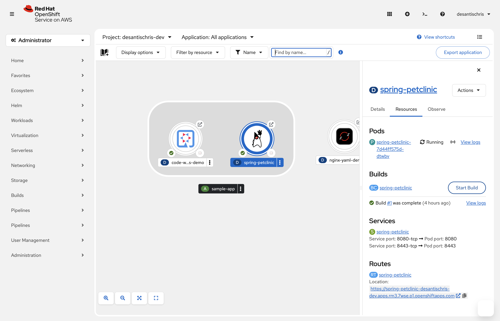
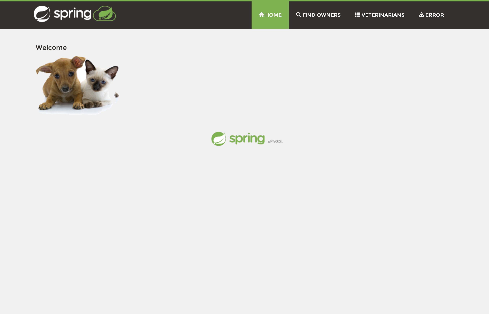
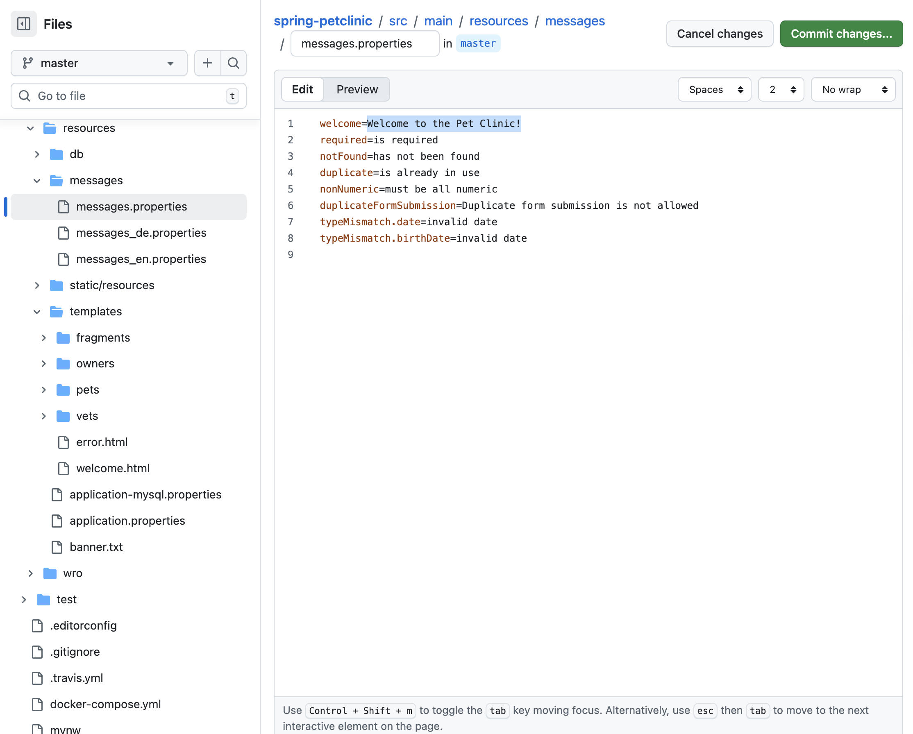
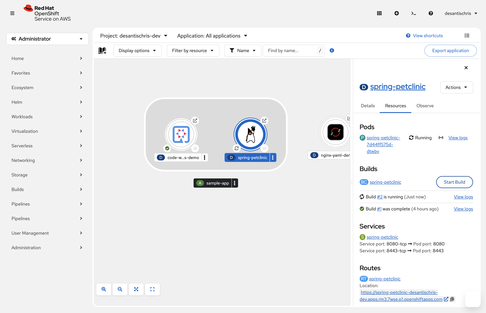
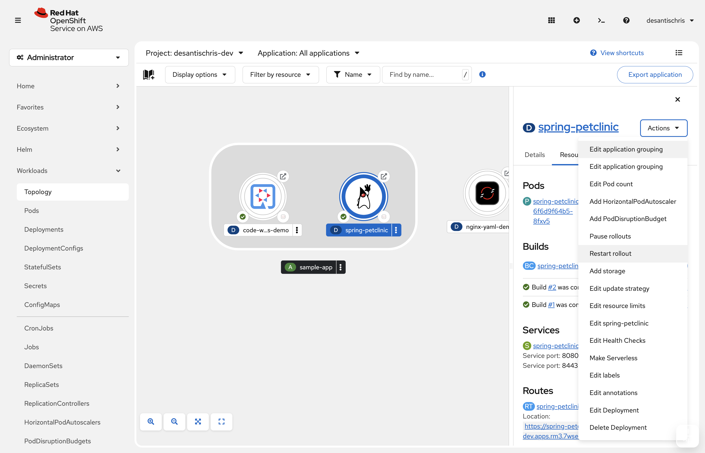
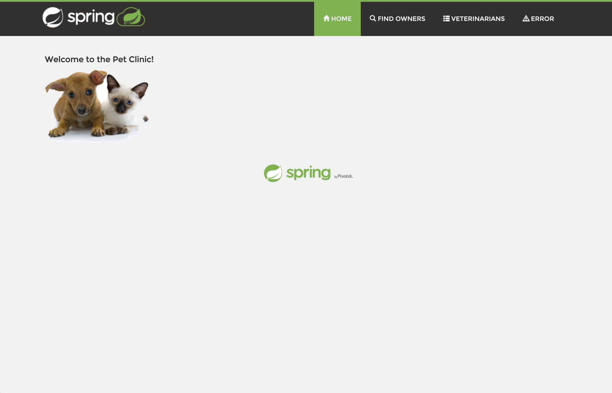

# Item 3: Import from Git Deployment

This project demonstrates deploying the Spring PetClinic Java application using the **Import from Git** feature in the OpenShift web console.

#### Key Features & Learnings
- **UI-driven workflow**: Everything is created and managed from the OpenShift web console (Developer perspective) without needing CLI commands.
- **Stable scaling**: The Deployment is kept at 1 replica via the Topology scale control so a runtime pod always exists and automatically recreates after failures.
- **Health checks**: Readiness and liveness probes on port 8080 (path `/`) are configured so OpenShift waits for Spring Boot to start and restarts unhealthy pods.
- **Public exposure**: A Service and Route are created so the PetClinic UI is reachable externally over HTTPS.
- **Full DevOps cycle**: Modified the Java app, committed and pushed the change, triggered a new build and rollout, and verified the change in the running application.

#### Steps

1. In the Red Hat Developer Sandbox, click the **+ Add** button in the left navigation.
   - Select **Import from Git**.
   - **(Optional but recommended)** Fork the repo https://github.com/siamaksade/spring-petclinic to your GitHub account.
   - Ensure **Resource type** is set to **Deployment** and **Create a route to the application** is checked, then click **Create**.

2. The application appears in the Topology view. Click the app icon.
   - In the side panel, confirm the Scale control is set to 1; if it shows 0, increase it to 1 so one pod is always maintained.

3. In the same side panel, open **Actions → Edit health checks**.
   - Add a **Readiness probe**: HTTP GET, path `/`, port 8080, Initial delay **60s**.
   - Add a **Liveness probe**: HTTP GET, path `/`, port 8080, Initial delay **120s**, period **30s**.
   - Save the changes so OpenShift only routes traffic when the app is ready and automatically restarts the pod if it becomes unresponsive.

4. In the side panel under **Resources**, locate the Build for spring-petclinic and click **Start build** if it is not already running.
   - Wait for the build to show **Completed**, then watch the pod under **Pods** transition from 0/1 to 1/1 Ready.
   - The health checks now govern readiness and restarts.

5. Open the linked Route for spring-petclinic to verify the Spring PetClinic UI is accessible in the browser.

6. Modify the value of the `welcome` property in the file `spring-petclinic/src/main/resources/messages/messages.properties`.

7. In the app properties window, kick off another build.

8. When the build completes, restart the rollout.

9. When a new pod is deployed and started, and the previous pod terminated, view the route. Observe the updated welcome message.

