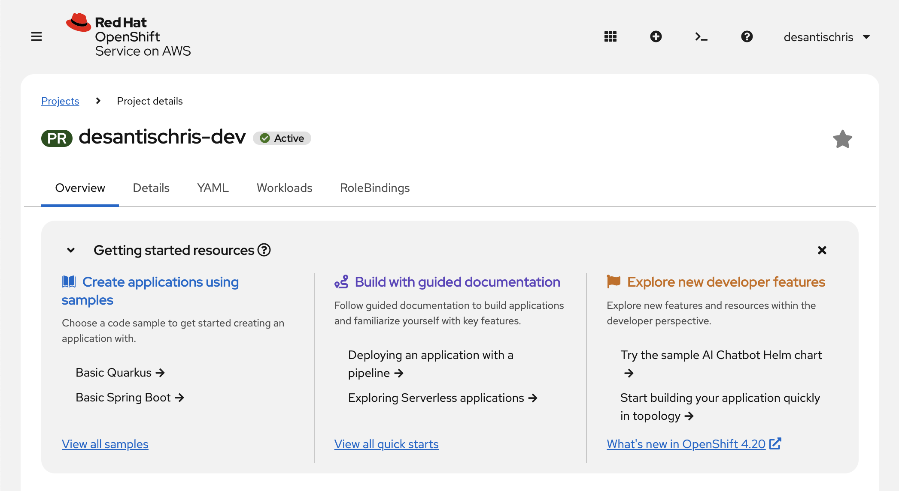
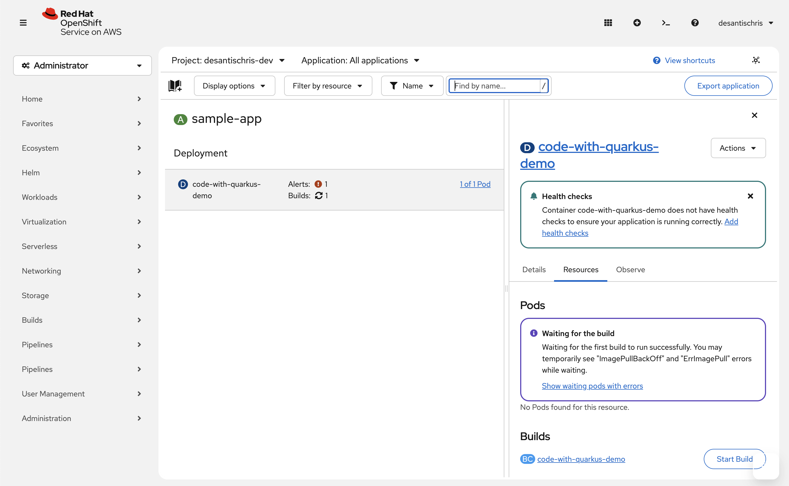
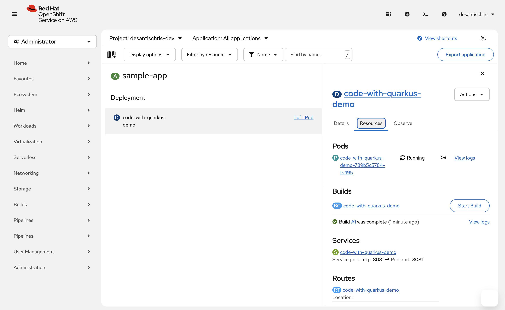
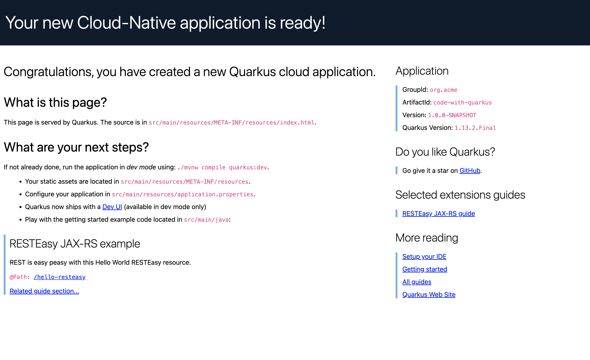
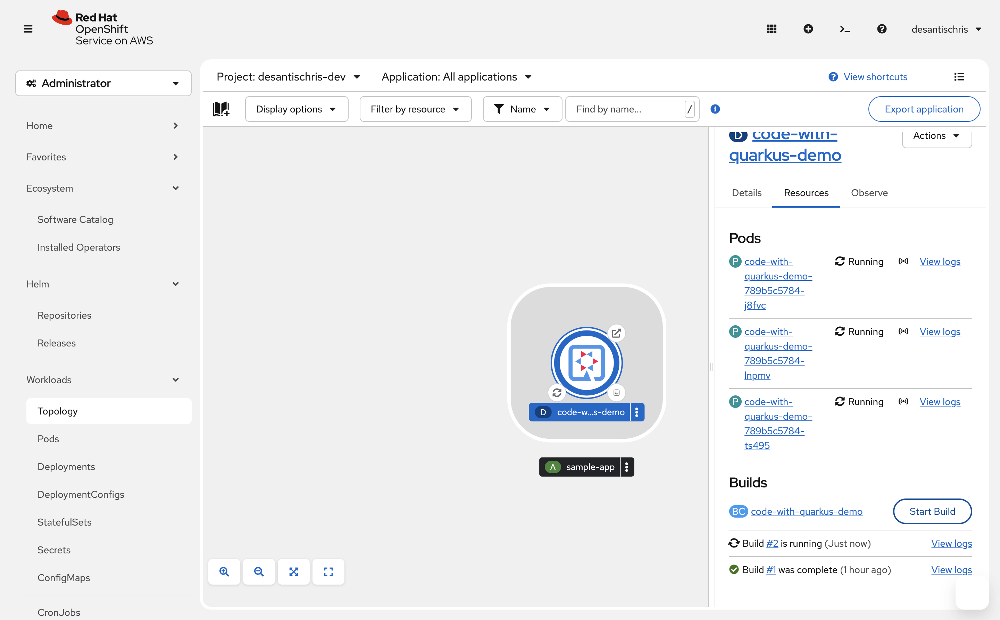

# Deploying & Managing a Quarkus Application on Red Hat OpenShift

Hands-on experience using the free Red Hat Developer Sandbox (OpenShift 4.20).

## Overview
In this tutorial, the user will:
1. Deploy sample Quarkus app via the console catalog.
2. Add readiness/liveness health checks to ensure stability.
3. Expose the app publicly with a Route.
4. Manually scaled replicas from 1 → 3 to demonstrate horizontal scaling and self-healing.
5. Trigger a new source-to-image build and verified rolling update across all pods.
6, Monitor via the Observe tab.

## Steps
1. In the Red Hat Developer Sandbox (https://sandbox.redhat.com/), select **Openshift**.
    - Select your project.
    - Under **Getting started resources**, select **View All Samples**.
    - Select **Basic Quarkus**.
    - Name the app and click **Create**

2. The app is created and a build is initiated.
    - Select **Add Health Checks**

3. Add health checks per the following:
    - Readiness Probe
      HTTP GET on path /q/health/ready
      Port: 8081 (or your app's port)
      Initial delay: 10-30 seconds (Quarkus starts fast)
      Period: 10-30 seconds
      Timeout: 1-10 seconds
      Failure threshold: 3
    - Liveness Probe
      HTTP GET on path /q/health/live
      Port: 8081 (or your app's port)
      Initial delay: 10-30 seconds (Quarkus starts fast)
      Period: 10-30 seconds
      Timeout: 1-10 seconds
      Failure threshold: 3
    - Startup Probe
      HTTP GET on path /q/health/live
      Port: 8081 (or your app's port)
      Initial delay: 10-30 seconds (Quarkus starts fast)
      Period: 10-30 seconds
      Timeout: 1-10 seconds
      Failure threshold: 3

4. Confirm the app runs without errors/issues

6. Under **Workloads > Toplogy**, select the app
    - In the properties window, select Resources
    - Click the link for the Route at the bottom.
    - Verify the sample app page loads

6. Navigate to **Workoads > Deployments**.
    - Select the app

7. Increase the pods from 1 to 3.

9. In the **Topology** view, observe the additional pods come online.

10. In the **Topology** view, start a new build
    - Observe the build run

10. Observe the pods redeploy with the new build

